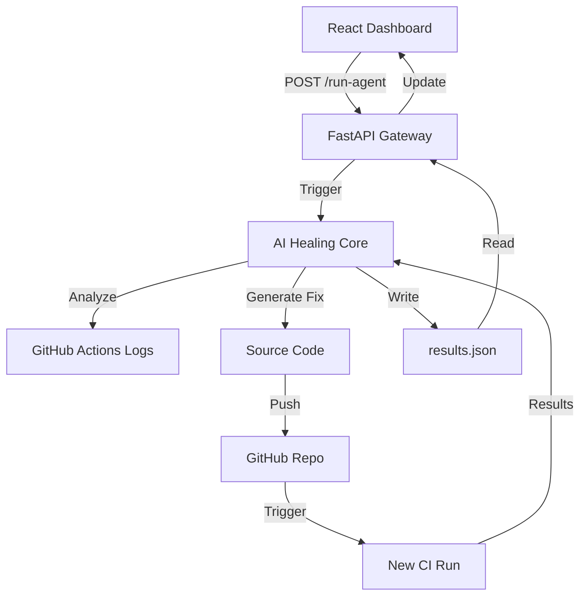

# 🛡️ Autonomous CI/CD Healing Platform


> **"The Self-Healing DevOps Workforce"**  
> An intelligent agent that autonomously detects, diagnoses, and patches CI/CD pipeline failures in real-time.

---

## 🔗 Quick Links
- **🚀 Deployment URL**: [https://autonomous-cicd-platform.vercel.app](https://autonomous-cicd-platform.vercel.app)
- **📹 LinkedIn Demo**: [Watch the Video](https://linkedin.com/in/example-video)
- **📂 Frontend Repo**: [github.com/team/frontend](https://github.com/team/frontend)
- **⚙️ Backend Repo**: [github.com/team/backend](https://github.com/team/backend)

---

## 🏗️ Architecture
The system follows a strict **Controller-Agent** architecture:
1.  **Frontend (React/Vite)**: Monitoring dashboard for developers to trigger agents and view fix timelines.
2.  **API Gateway (FastAPI)**: Async orchestrator that manages agent lifecycles and GitHub webhooks.
3.  **AI Core (Python)**: The "Healing Intelligence" that parses logs, generates patches, and verifies fixes.
4.  **CI Monitor**: Polling service that tracks GitHub Actions status in real-time.



---

## 📦 Installation & Setup

### Prerequisites
- Node.js v18+
- Python 3.9+
- Redis (for async tasks)
- GitHub Personal Access Token (PAT)

### Environment Variables
Create a `.env` file in the root:
```ini
GITHUB_TOKEN=ghp_xxxxxx
OPENAI_API_KEY=sk-xxxxxx
RAILWAY_TOKEN=xxxxxx
```

### Quick Start
```bash
# 1. Clone the repository
git clone https://github.com/your-team/autonomous-healing-platform.git
cd autonomous-healing-platform

# 2. Install dependencies
pip install -r requirements.txt
npm install

# 3. Run the complete stack (using Docker Compose)
docker-compose up --build
```

---

## 🛠️ Tech Stack
| Component | Technology |
|-----------|------------|
| **Frontend** | React, Vite, Tailwind CSS, Zustand, Recharts |
| **Backend** | FastAPI, Pydantic, Uvicorn, AsyncIO |
| **AI Core** | LangChain, GPT-4, AST Parsing |
| **Infra** | GitHub Actions, Vercel, Railway, Docker |

---

## 🐛 Supported Bug Types
The agent currently supports auto-remediation for:
- ➗ `ZeroDivisionError`
- 🐍 `IndentationError`
- 📦 `ModuleNotFoundError`
- 🐍 mentioned in PS
- ⚠️ Docker Build Failures
- 🧪 Pytest Assertion Failures

---

## ⚠️ Known Limitations
- Fix verification relies on existing test coverage; sparse tests may lead to unverified patches.
- Logic errors requiring deep business context are flagged for human review.
- complex code which contents more than 30 failure takes 2 min max
---

## 👥 Team & Contributions

| Member | Role | Key Contributions |
| :--- | :--- | :--- |
| **[Harsh Shinde]** | **Lead Architect & Integration** | • System Design & Architecture (React → FastAPI → AI Core)<br>• FastAPI Gateway Development & Async Orchestration<br>• strict Schema Enforcement (Pydantic models for `results.json`)<br>• Final Integration Testing & Quality Assurance |
| **[Rohit Dhanngar]** | **AI Core Engineer** | • **"Healing Intelligence"** Development (LangChain/LLM Logic)<br>• AST Parsing & Patch Generation Algorithms<br>• Verification Engine (Pytest/Jest Test Runners)<br>• Prompt Engineering for Error Analysis |
| **[Prerna Bothara]** | **Frontend Developer** | • **Dashboard UI/UX** (React, Tailwind, Motion)<br>• Data Visualization (Recharts for fix rates/timelines)<br>• State Management (Zustand Global Store)<br>• Real-time Polling Logic & User Feedback Loops |
| **[Anjesh Suryawanshi]** | **DevOps & Cloud Engineer** | • **Infrastructure as Code** (Docker, Railway, Vercel)<br>• CI/CD Pipeline Configuration (GitHub Actions)<br>• `ci/github_monitor.py` (GitHub API Polling Service)<br>• Security & Environment Management (Secrets/Tokens) |

---

## 📝 License
MIT License © 2024 Autonomous DevOps Team
